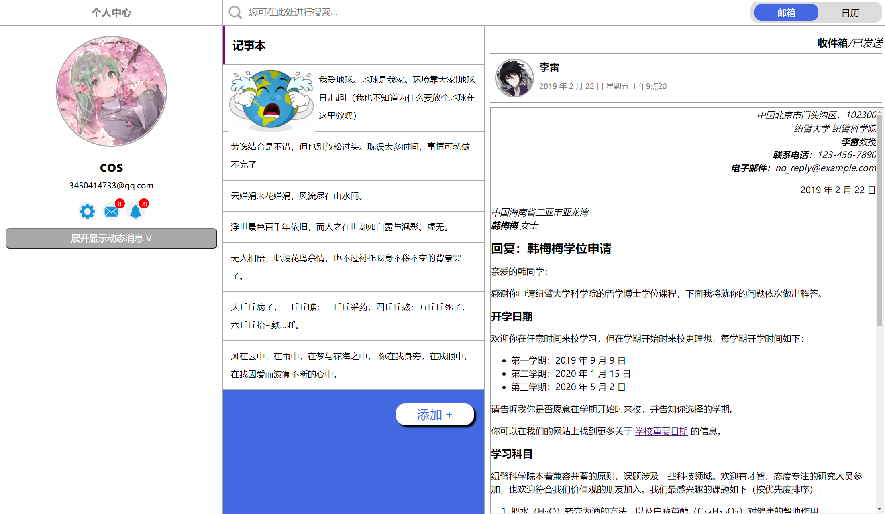
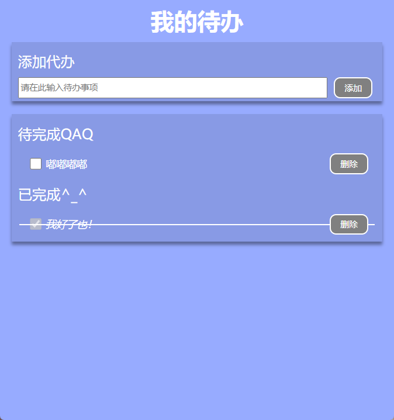

# 我是谁？

- 一个平平无奇的前端工程师，目标是写出更多好看、好用、好玩的页面！
- 自大二开始，就有用博客记录学习成长的想法，一开始只是单纯的在CSDN上发一些数据结构练习，学习等博客，后来涉猎的知识也开始多了起来，主要还是以笔记为主23333也方便自己的复习，偶尔也发一些题目记录、技术文章等。
- 搭建步骤参考此博客：[Hexo + vercel 部署博客](https://ysx.cosine.ren/hexo-vercel-deploy-blog)
 
# 现在正在进行的是？
- 2022/9/27 实习到现在都没怎么打理过博客，准备大干一场（大概
- 2022/5/6 一眼看到shoka这个主题就爱上了，开冲！立马更换成了这个主题。
- 2022/3/20 找暑期实习真难哇！！也有在刷题惹
- 2022/3/1 百度进阶班项目临近结束，准备冲刺春招暑期实习~
- 2022/2/9 于是乎，今天搭了这个博客（经常忘记要干啥x）
- 2022/1/17 大作业还不容易23333不过做完还是很有成就感
- 2022/1/14 学前端走火入魔ing
- 2022/1/8 寒假了，在家了，开始摸鱼
- 2021/12/25 一周三个课设，实在顶不住了（在做了，在做了，咕——） 

# 前端学习成果历程
- 2022.07~至今 实习 学到很多东西，Next.js, tailwind, recoil, wagmi, recharts, ts, motion, floating-ui……
- 2022.06-2022.07 实习，开发公司wiki项目等 接触了docker, jenkins, Nest.js, vue3……
- 2022.03-2022.06 春招 投简历、找实习、背八股、提升技术~~~
- 2022.02-2022.03 百度进阶班项目 Campus SNS校园社区后端接口系统
- 2022.01 初学前端，参加百度前端训练营、字节前端训练营、开始系统性的学习前端，看了红宝书等
## P12 airdrop页开发
加入P12团队后，主要使用 `React` + `Typescript` + `Recoil` + `Next.js` + `Tailwind CSS` 开发公司 Web3 项目，这期间呢也是
- 封装 axios 设置通用请求拦截器携带 token 等，并使用 react-query 封装中间请求状态
- 更换状态管理库为 Recoil，封装了各种通用自定义 hook 及业务用 hook，更换 web3-react 为 wagmi，大大降低业务复杂度
- 负责 [airdrop-interface](https://github.com/ProjectTwelve/airdrop-interface) 最新 collab 开发，完成了从静态页面开发到后端联调提测全流程，最终顺利上线

这个项目，可以说让我学到了很多东西，因为用到的技术都蛮新的，而且因为是开源所以做的也比较用心，最关键的是设计设计的也很好看~做起来非常开心

### 在线地址
在线地址：[airdrop.p12.games](https://airdrop.p12.games/)
P12 官网：[p12.network](https://p12.network/)
Github地址：[airdrop-interface](https://github.com/ProjectTwelve/airdrop-interface)、[P12 Team](https://github.com/ProjectTwelve)


## 仿antd日期选择器~
也算是第一次用React写自己的小组件，封装性还不行，bug也还有不少，写的代码自己复盘的时候也很想吐槽2333

不过也真的是个很有意思的事！比如点击日期选择器外关闭日期选择器这个功能就纠结了我好长时间qwq，但是写完真的很快乐！
- 使用了React的来ref判断点击事件发生在组件内部还是外部~
- 实现自己的组件是很cool的事！~虽然有时候也会感觉有点重复造轮子~
- 在学习antd组件的实现同时也感受到了其实现的不少细节，望尘莫及ovo，以后有机会还会有优化哒，增加更多api和功能和自定义大小设置等。

### 在线地址
- 参考的组件为：[Ant Design DatePicker日期选择框](https://ant.design/components/date-picker-cn/)
- Github地址：[https://github.com/cosineLearn/cosine-ui](https://github.com/cosineLearn/cosine-ui)
- 博客地址：[仿Antd组件之DatePicker组件实现（简易）](https://ysx.cosine.ren/implementation-of-datepicker/)
- CodePen在线预览链接：[DatePicker（by cos）](https://codepen.io/yusixian/pen/wvPLgWN)


{.gallery}

## Campus SNS校园社区后端
项目地址：[Campus SNS校园社区后端](https://github.com/yusixian/campus-community-backend)
- 技术栈 `Koa2` `Node.js` `Sequelize` `Websocket`，2022年01月 - 2022年03月
- 百度前端训练营晋级班项目，具备完善的校园社区功能及一个后台管理系统
1. 使用 PM2 将项目部署至自己的云服务器，配置 Nginx反向代理 解决跨域问题，设置了错误日志及日志分割
2. 利用 Sequlize ORM 进行数据库的操作，使用 JWT 实现用户身份验证与信息加密
3. 进行过 1 次重构，优化数据库结构，利用 WebSocket 实现在线用户数监测

我呢主要负责了文章管理、分区管理和系统管理这块的接口，是第一次做出来的比较完善的项目~当然当时做的也比较稚嫩

这个项目的开发文档也是非常详细的~因为是第一次团队合作开发项目所以记录了很基础的搭建过程

### 项目地址
### 功能说明
- 数据统计
	- 获取社区十大热帖
	- 获取社区十大红人
	- 近7日文章增长量等统计

- 用户管理 user
	- 上传头像
	- 修改用户信息

- 文章管理 article

	- 添加文章
	- 删除/屏蔽文章
	- 获取文章总数
	- 恢复被删除/屏蔽文章

- 评论管理 comment 
	- 回复文章
	- 回复评论

- 分区管理 partition

	- 添加分区
	- 删除分区
	- 自定义分区图标

- 系统管理

	- 在线用户
	- 操作日志
	
- 用户的注册及登录
	- 用户信息修改等
- 普通用户功能
	- 发帖 (新发布帖子待管理员审核通过后方可发布)
	- 编辑
	- 删除自己的帖子
- 管理员功能
	- 帖子修改、删除功能
	- 屏蔽、恢复功能
	- 帖子审核功能
- 可选功能
	- 支持模糊搜索、搜索关键字联想
	- 支持点赞
	- 支持收藏
	- 支持发图片
## 百度前端训练营作业
### 结课作业
- 完成特点：尽量保证了和设计稿的基本一致性，加入了css动画实现筛选和选择框移入时的渐入效果，实现了当选择的学校所在省市靠后时，调整左侧区域的滚动高度。在用户层面改善体验。利用本地LocalStorage进行存储并封装了相应通用工具。年份可选择的范围，和界面是解耦，通过js中的常量自定义开始和结束年份。
- github地址：[class-ending-homework](https://github.com/yusixian/class-ending-homework)
- 在线预览链接：https://ysx.cosine.ren/project/class-ending-homework/index.html
- 完成了如下功能：
  - step1：完成静态页面的布局及样式开发
  - step2：实现报名区域、课程安排的筛选功能
  - step3：实现点击弹出年份选择面板，并增加弹出框和课程的渐进动画
  - step4：实现选择学校面板，左侧选中某个省市时，右侧的院校List会联动发生改变，只显示该省市下的院校。省市保证了至少10个，至少有1个省市包含的院校超过20个。
  - step5：实现报名提交的邮箱的正则验证与提示，报名成功后的重新报名选项。
#### 组件封装-Picker
- 将学校、年份选择的弹出框封装为Picker组件，路径为src/component/Picker
- `<div id="school-picker" class="select"></div>`
- 必选参数为id、data，可选参数为placeHolder、name、storeKey
```js
let yearPicker = new Picker('date-picker', Array.from(new Array(yearLen), (v, k) => START_Year+k), '请选择入学年份', 'year');
let schoolPicker = new Picker('school-picker', areaList, '请选择学校', 'school');
```
#### 组件封装-Prompt
- 将提示框封装为Prompt组件，路径为src/component/Prompt
`<div class="prompt" style="display: none;"></div>`
- 必选参数为id
```js
let submitPrompt = new Prompt('.prompt');
prompt.promptError(errorMsg);
```
#### 渐进动画
- 设置渐进动画，时长为0.2s,位于src/component/animation.css
#### 事件处理
- 组件事件在其js中，全局事件在src/js/event/event.js中
- 组件事件包括提示Prompt事件（promptSuccess、promptError）、选择框Picker事件（refreshItems、selectItem）等
- 全局事件包括课程筛选事件（displayCourseListAll、refreshCourseList、fliter）、报名提交事件（refreshRegisterArea、submitInfo）

- step1：完成静态页面的布局及样式开发
- step2：实现报名区域、课程安排的筛选功能
- step3：实现点击弹出年份选择面板，并增加弹出框和课程的渐进动画
- step4：实现选择学校面板，左侧选中某个省市时，右侧的院校List会联动发生改变，只显示该省市下的院校。省市保证了至少10个，至少有1个省市包含的院校超过20个。
- step5：实现报名提交的邮箱的正则验证与提示，报名成功后的重新报名选项。
#### 演示

### 百度前端训练营平时作业
百度前端训练营作业
不用任何框架，原生实现：
- homewok1-1 [Hello World](https://ysx.cosine.ren/project/homework-day1/html/hello.html)
- homewok1-附加题 简历 [My Resume](https://ysx.cosine.ren/project/homework-day1/html/resume.html)
- homework2-1 信件标记 [纽臂大学李雷来信](https://ysx.cosine.ren/project/homework-day2/src/1_letter/letter.html)
- homework2-2 加载小动画 [css加载动画](https://ysx.cosine.ren/project/homework-day2/src/2_loading/loading.html)
- homework2-3 flex实现垂直水平居中 [方块垂直水平居中](https://ysx.cosine.ren/project/homework-day2/src/3_flex/flex.html)
- homework2-4 定位实现垂直水平居中 [方块垂直水平居中-定位实现](https://ysx.cosine.ren/project/homework-day2/src/4_position/position.html)
- homework2-5 简单的响应式demo 响应式demo：[随屏幕大小变化方块的颜色](https://ysx.cosine.ren/project/homework-day2/src/5_ResponseDemo/demo.html)
- homework2-6 附加题 [布局练习](https://ysx.cosine.ren/project/homework-day2/src/6_附加题/demo.html)
- homwork3  1-4  文件树转html/字符串、深拷贝、数字时钟 [js练习](https://ysx.cosine.ren/project/homework-day3/index.html)
- homwork3  选做题 todolist [todolist(by cos)](https://ysx.cosine.ren/project/homework-day3/todolist.html)
- homwork4  添加/上传表单数据  [HomeWork_Day4](https://ysx.cosine.ren/project/homework-day4/index.html)
- 结课作业 暂不要求手机端适配  [结课作业](https://ysx.cosine.ren/project/class-ending-homework/)
    - step1：完成静态页面的布局及样式开发
    - step2：实现报名区域、课程安排的筛选功能
    - step3：实现点击弹出年份选择面板，并增加弹出框和课程的渐进动画
    - step4：实现选择学校面板，左侧选中某个省市时，右侧的院校List会联动发生改变，只显示该省市下的院校。省市保证至少10个，至少有1个省市包含的院校超过20个。
    - step5：实现报名提交的验证与提示，报名成功后的重新报名选项！完成！
    - 实现组件封装，将Picker和Prompt封装为新的组件
    - github地址：[class-ending-homework](https://github.com/yusixian/class-ending-homework)
比较有意思的有：布局练习、homework3的todolist、结课作业

#### 布局练习
- 在线预览链接：https://ysx.cosine.ren/project/homework-day2/src/6_附加题/demo.html


#### todolist
- 在线预览链接：https://ysx.cosine.ren/project/homework-day3/todolist.html


#### 文件树转html/字符串、深拷贝、数字时钟
js代码如下
```js
// 1、根据传进来的参数，返回html字符串
function tree2html(ftree) {
    if(!ftree) return null;
    let str = '';
    // console.log(ftree);
    for(let i = 0; i < ftree.length; ++i) {
        let element = ftree[i];
        if(i+1 < ftree.length && ftree[i+1] instanceof Array) { 
            let t = `<li>${element}<ul>${tree2html(ftree[i+1])}</ul></li>`;   // 模板字面量
            str += t;
            // console.log(t);
            ++i;
        } else {
            let t = `<li>${element}</li>`;   // 模板字面量
            str += t;
            // console.log(t);
        }
    }
    // console.log(str);
    return str;
}
// 2、写一个函数，可以将任意层级的文件树数组转换为字符串
function tree2str(ftree, level) {
    if(!ftree) return null;
    let str = '';
    // console.log(ftree);
    for(let i = 0; i < ftree.length; ++i) {
        let element = ftree[i];
        let father = `${'&nbsp;'.repeat(6*level)}|---${element}<br/>`;
        str += father;
        while(i+1 < ftree.length && ftree[i+1] instanceof Array) {
            let son = `${tree2str(ftree[i+1], level+1)}`;   // 模板字面量
            str += son;
            // console.log(t);
            ++i;
        }
    }
    return str;
}
// 3、实现深拷贝
let obj1 = {
    "name": "obj1",
    "age": 23,
    "sex":"女"
};
let obj2 = obj1;    //这是浅拷贝
obj2.age = 18;
obj2.name = "obj2";
console.log(obj1);
console.log(obj2);  //可以看到两个对象指向一个引用 输出的值都是修改过后的
function deepClone(obj) {
    if(typeof obj !== 'object' || obj === null) return obj;
    let result = (obj instanceof Array)?[]:{};  // 判断一下是数组还是对象
    let keys = Object.keys(obj); //过滤原型链
    keys.forEach(key => {
        result[key] = deepClone(obj[key]);
    });
    return result;
}
let obj3 = deepClone(obj2);
obj3.name = 'obj3';
obj3.age = 24;
obj3.sex = '男';
console.log(obj2);
console.log(obj3); 

// 4、数字时钟 主程序中调用setInterval(setNowTime,0)实现
function setNowTime() {
    let d = new Date();
    let h = d.getHours();
    let m = d.getMinutes();
    let s = d.getSeconds();
    h = (h>=10)?h:'0'+h;
    m = (m>=10)?m:'0'+m;
    s = (s>=10)?s:'0'+s;
    let dc = document.getElementById('digital-clock');
    dc.innerHTML = `${h}:${m}:${s}`;
    console.log(`${h}:${m}:${s}`);
}
```